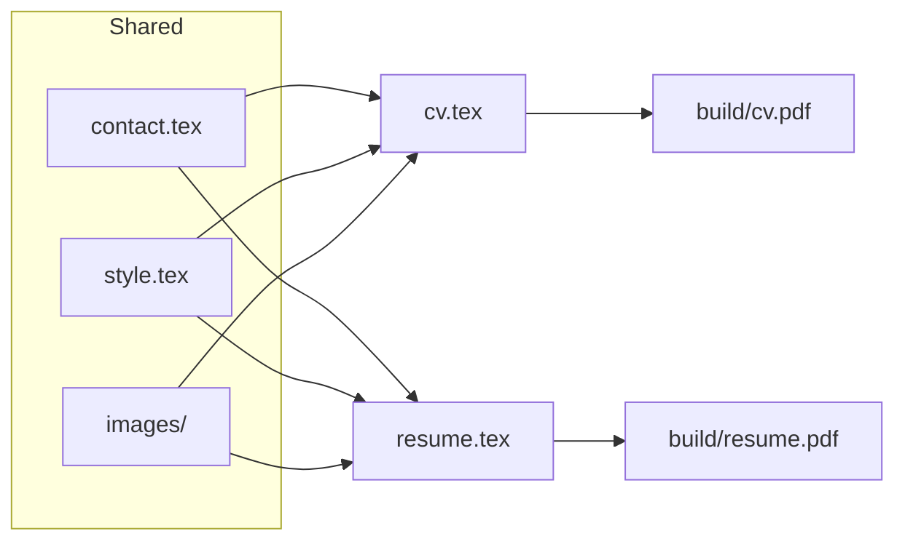
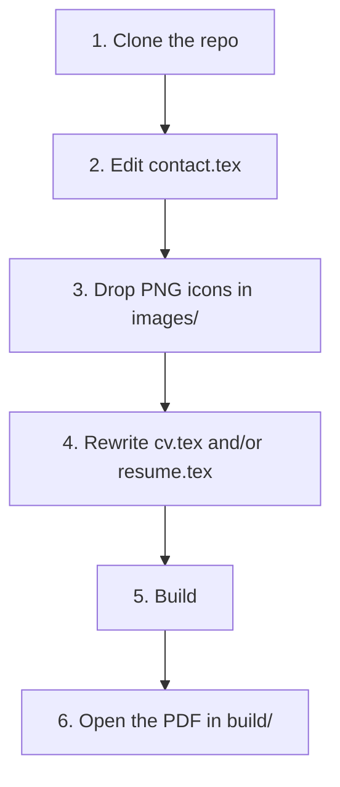
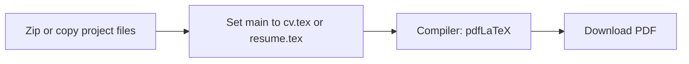

<div align="center">

# ATS-Friendly CV / Resume Generator

**Single-column LaTeX templates that compile to selectable, parser-friendly PDFs.**

`cv.tex` up to 3 pages &nbsp;·&nbsp; `resume.tex` exactly 1 page &nbsp;·&nbsp; MIT License

[](https://www.latex-project.org/)
[](#ats-notes)
[](LICENSE)
[](#build)

> Sample content uses a fictional person, **Alex M. Rivera**. Replace every placeholder before you send a PDF.

</div>

---

## What you get

| | **CV** `cv.tex` | **Resume** `resume.tex` |
| :---: | :--- | :--- |
| **Length** | Up to **3 pages** | **1 page** |
| **Use when** | Academic, government, or full-history applications | Most job postings |
| **Experience** | Full work history (sample has 9 roles) | Top **4** roles, condensed bullets |
| **Also includes** | Affiliations, long cert list, research, references | Compact skills, selected certs, leadership line |
| **Shared files** | `contact.tex` + `style.tex` + `images/` | same |



---

## Path from clone to PDF



| Step | What to do |
| :---: | :--- |
| **1** | Clone this repository |
| **2** | Replace every `\newcommand` in `contact.tex` |
| **3** | Put icons in `images/` using the filenames below |
| **4** | Swap the sample Alex Rivera copy for your own |
| **5** | Run the build for your OS, or compile on Overleaf |
| **6** | Check `build/cv.pdf` and `build/resume.pdf` |

---

## Build

<details>
<summary><strong>Windows (PowerShell + MiKTeX)</strong></summary>

<br/>

Install [MiKTeX](https://miktex.org/), then from the project root:

```powershell
.\build.ps1
```

Writes `build/cv.pdf` and `build/resume.pdf`.

One file at a time:

```powershell
New-Item -ItemType Directory -Force -Path build | Out-Null
pdflatex -interaction=nonstopmode -output-directory=build cv.tex
pdflatex -interaction=nonstopmode -output-directory=build resume.tex
```

</details>

<details>
<summary><strong>macOS / Linux (TeX Live or MacTeX)</strong></summary>

<br/>

```bash
chmod +x build.sh
./build.sh
```

Or:

```bash
mkdir -p build
pdflatex -interaction=nonstopmode -output-directory=build cv.tex
pdflatex -interaction=nonstopmode -output-directory=build resume.tex
```

Debian / Ubuntu packages: `texlive-latex-recommended texlive-latex-extra`

</details>

<details>
<summary><strong>Overleaf (no local install)</strong></summary>

<br/>



1. Upload a zip, or copy `cv.tex`, `resume.tex`, `contact.tex`, `style.tex`, and `images/`.
2. Set the **main document** to `cv.tex` or `resume.tex`.
3. Choose the **pdfLaTeX** compiler.
4. Download the PDF.

</details>

---

## Icons in `images/`

The header prints **real text** next to each icon so ATS software can still read email, phone, and links.

| File | Shown next to |
| :--- | :--- |
| `images/Email.png` | Email address |
| `images/Phone.png` | Phone number |
| `images/Website.png` | Personal site |
| `images/LinkedIn.png` | LinkedIn profile |
| `images/Github.png` | GitHub profile |

> Square PNG, 256x256 or larger, works well. Overwrite these files. Keep the names, or update `\contactheader` in `style.tex`.

---

## Edit once, use twice

`contact.tex` feeds both templates:

```tex
\newcommand{\name}{YOUR NAME}
\newcommand{\email}{you@example.com}
\newcommand{\phone}{+1 (555) 010-1234}
\newcommand{\location}{City, Country}
\newcommand{\websiteurl}{https://your-site.example}
\newcommand{\websitetext}{your-site.example}
\newcommand{\linkedinurl}{https://www.linkedin.com/in/your-handle/}
\newcommand{\linkedintext}{linkedin.com/in/your-handle}
\newcommand{\githuburl}{https://github.com/your-handle}
\newcommand{\githubtext}{github.com/your-handle}
```

A role block looks like this. Dates stay on the same line as the organization:

```tex
\entry{Organization Name}{January 2024 -- Present}
\role{Job Title}
\begin{itemize}
    \item Start with a verb. Add a tool or result when you can.
    \item Keep each bullet to one or two lines.
\end{itemize}
```

Copy a template if you want role-specific versions (`resume-software.tex`, `cv-academic.tex`). Point each copy at the same `contact.tex` and `style.tex`.

---

## ATS notes

- Stay **single column**. Do not put the main history in a table or text box.
- Keep contact details as **real text** next to icons.
- Use common section names: Education, Experience, Skills, Certifications.
- Bold tools and posting keywords inside normal sentences.
- Skip headers, footers, and text hidden behind images.
- After each edit, rebuild. Confirm the resume is still **one page** and the CV is at most **three**.

---

## Project map

```
.
├── cv.tex          # full CV, up to 3 pages
├── resume.tex      # one-page resume
├── contact.tex     # shared name and links
├── style.tex       # shared layout and icon helpers
├── images/         # Email, Phone, Website, LinkedIn, Github
├── build.ps1       # Windows
├── build.sh        # macOS / Linux
├── LICENSE
└── README.md
```

`build/` is gitignored. Compile locally. Do not commit personal PDFs.

---

## License

[MIT](LICENSE). Issues and pull requests welcome. Keep templates ATS-safe and keep sample names fictional.
